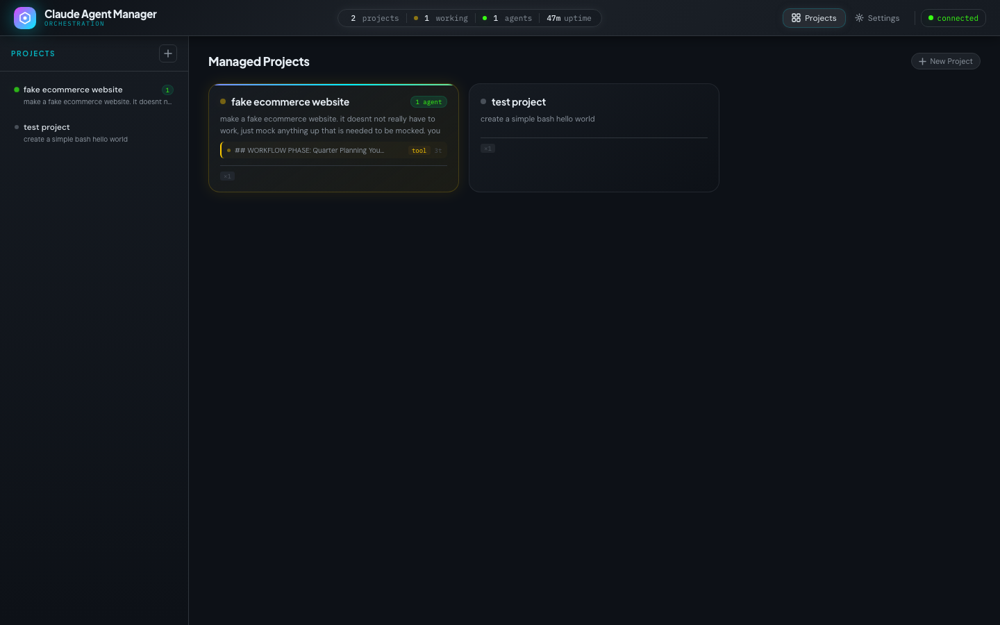
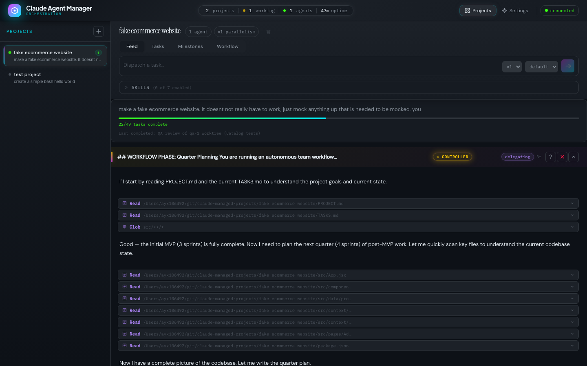
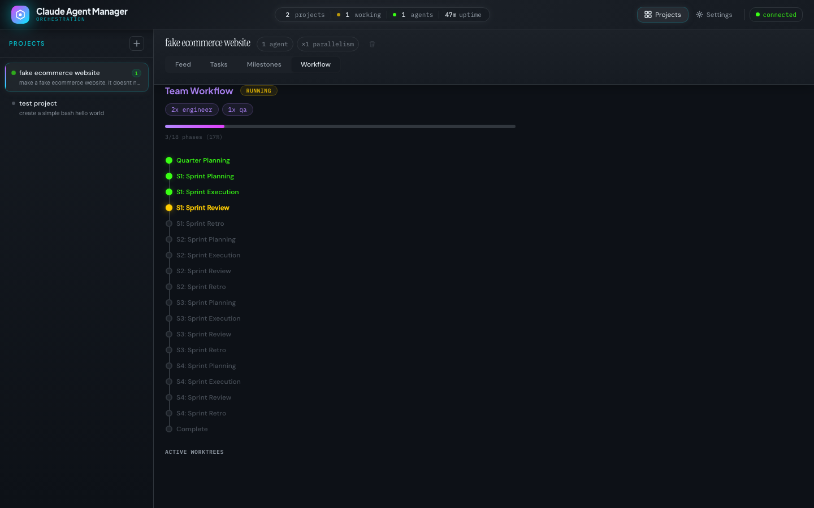
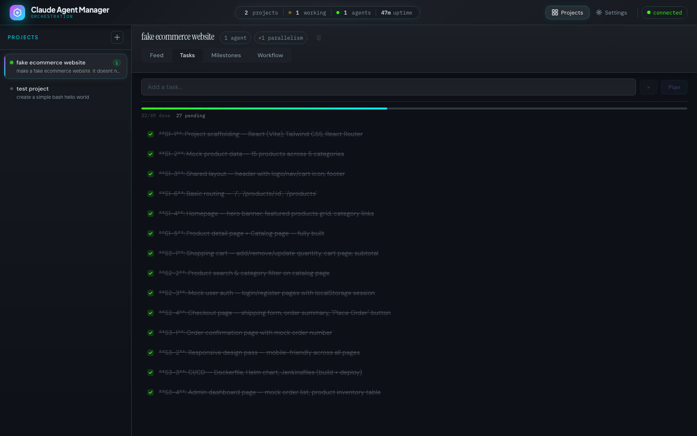

# Claude Manager

An agent orchestration dashboard for running autonomous Claude agents against managed projects. Dispatch tasks, watch agents work in real time, inject follow-up messages mid-session, and run full team workflows — sprint by sprint — with automatic planning, execution, and reporting.

  

## Demo

<video src="docs/demo/demo.mp4" controls muted autoplay loop width="100%"></video>

### Dashboard — project tiles with live agent status


### Live agent feed — real-time streaming with markdown rendering


### Autonomous team workflow — sprint phases with progress tracking


### Task management — checklist synced with agent work


---

## How it works

```
┌────────────────────────────────────────────────────────────┐
│ Browser (SPA)                                              │
│  Sidebar: project list   Center: agent cards   Right: chat │
└────────────────────────────────────────────────────────────┘
              ↕ HTTP + WebSocket
┌────────────────────────────────────────────────────────────┐
│ Backend (FastAPI · docker-compose on host)                 │
│  AgentBroker → AgentSession → Anthropic SDK streaming      │
│  RulesEngine (30s tick) → auto-spawn / health rules        │
│  ToolExecutor: Bash · Read · Write · Edit · Glob · Grep    │
└────────────────────────────────────────────────────────────┘
              ↕ filesystem
~/git/claude-managed-projects/{project}/   ← managed repos
~/.claude/projects/-managed-sessions/      ← JSONL history
```

Each **managed project** is a git repo. You dispatch a task → an `AgentSession` opens a persistent Anthropic streaming connection → the agent reads, thinks, calls tools, writes files → streams back live over WebSocket. You can inject messages at any time. Sessions stay alive (IDLE) waiting for the next message rather than exiting after each response.

---

## Features

- **Autonomous team workflows** — define a team (engineers, QA, devops), set sprint count, and watch the system autonomously plan a quarter, execute sprints, review code, and generate retro reports — all without intervention
- **Git worktree isolation** — each team role gets its own git worktree during sprint execution so parallel agents never conflict; worktrees are merged back to main after review
- **Controller + subagent architecture** — a persistent controller agent (the "brain") delegates all work to ephemeral subagents via Claude's Agent tool, with structured checklist results
- **Live streaming** — text deltas, tool start/done events, phase transitions, and rich markdown rendering all pushed over WebSocket in real time
- **Task & milestone tracking** — TASKS.md synced checklist with progress bars; milestones auto-captured from completed work cycles
- **Message injection** — send follow-up messages to a running or idle session; mid-turn injections are queued and delivered cleanly between tool calls
- **Multi-agent parallelism** — configure a project to run N concurrent sessions per dispatch
- **Custom agent roles** — define reusable personas with system prompts, expertise tags, and behavioral traits; roles are injected into agent prompts during workflow execution and shared across all templates
- **Artifacts browser** — IDE-like file tree + content preview tab; browse project files with syntax highlighting, line numbers, git status badges, and breadcrumb navigation — all without leaving the dashboard
- **Skills system** — per-project skill toggles, marketplace browser, and skill creator
- **Operator rules engine** — declarative reconciliation loop: `SessionHealthRule` cancels stuck sessions, `ProjectAutoSpawnRule` keeps N agents alive per project, `DirectoryWatchRule` triggers agents on file changes
- **Bootstrap** — create a project from the UI; generates `PROJECT.md`, `TASKS.md`, `INSTRUCTIONS.md`, `.claude/settings.local.json`, and an initial git commit, then immediately spawns a controller agent
- **Settings UI** — view/edit `~/.claude/settings.json` and toggle installed plugins

---

## Architecture

```
backend/
├── main.py                  FastAPI app, all HTTP + WS endpoints
├── models.py                Pydantic models (Agent, SessionPhase, ManagedProject…)
├── ws_manager.py            WebSocket broadcast manager
│
├── broker/                  Agentic execution engine
│   ├── agent_broker.py      Session registry; wires callbacks → WS broadcasts
│   ├── agent_session.py     Per-session asyncio run loop (stream → tools → repeat)
│   ├── tool_executor.py     Tool implementations (Bash, Read, Write, Edit, Glob, Grep)
│   └── history_store.py     In-memory conversation history + JSONL persistence
│
├── rules/                   Operator reconciliation
│   ├── engine.py            30s tick loop; check() → fire() per rule
│   ├── operator_rule.py     Abstract base (check, fire, cooldown)
│   └── builtin_rules.py     SessionHealthRule, ProjectAutoSpawnRule, DirectoryWatchRule
│
└── services/
    ├── projects.py          Scan/bootstrap managed projects from disk
    ├── workflows.py         Workflow state machine, worktree lifecycle, phase prompts
    ├── templates.py         Template discovery, loading, prompt rendering
    ├── roles.py             Custom role CRUD (personas, expertise), merged role lookup
    ├── artifacts.py         File browsing, content preview, git status for projects
    ├── skills.py            Skill discovery, per-project toggles, marketplace
    └── settings.py          Read/write ~/.claude/settings.json and plugins

frontend/
├── index.html               SPA entry point (3-column layout)
├── js/
│   ├── app.js               State machine, WS event handlers, dispatch/inject/kill
│   ├── projects.js          Render project list, tile grid, agent cards
│   ├── api.js               REST client
│   ├── ws.js                WebSocket client (auto-reconnect, ping)
│   ├── settings.js          Settings editor UI
│   ├── utils.js             escapeHtml, toast, formatters
│   └── feed/
│       ├── FeedController.js  Tab switching, agent sections, stream rendering
│       ├── TasksPanel.js      TASKS.md CRUD checklist
│       ├── MilestonesPanel.js Auto-captured work cycle history
│       ├── WorkflowPanel.js   Team setup + sprint phase timeline
│       └── ArtifactsPanel.js  File tree + content preview with syntax highlighting
└── css/
    ├── app.css              Dark theme, design tokens, responsive layout
    └── feed.css             Agent cards, tools, stream, workflow panel

infrastructure/helm/claude-manager/   Helm chart (frontend only; backend runs on host)
ci/
├── build.Jenkinsfile        Kaniko → in-cluster registry
└── deploy.Jenkinsfile       helm upgrade --install
```

---

## Quick start

### Prerequisites

- Docker Desktop (for the backend container)
- An `ANTHROPIC_API_KEY`
- The managed projects directory (default: `~/git/claude-managed-projects/`)

### Run locally

```bash
git clone git@github.com:scoady/claude-manager.git
cd claude-manager

export ANTHROPIC_API_KEY=sk-ant-...
docker compose up --build
```

The backend runs at `http://localhost:4040`.

For the frontend in development, open `frontend/index.html` directly or run:

```bash
cd frontend && npx vite
```

### Environment variables

| Variable | Default | Description |
|---|---|---|
| `ANTHROPIC_API_KEY` | — | **Required.** Anthropic API key |
| `MANAGED_PROJECTS_DIR` | `~/git/claude-managed-projects` | Root directory for managed project repos |
| `CLAUDE_DATA_DIR` | `~/.claude` | Path to Claude's data dir (session history, settings) |

---

## Managed projects

Each project lives under `MANAGED_PROJECTS_DIR` and is a standard git repo with a few extra files:

```
my-project/
├── PROJECT.md               Goals, scope, constraints (read by agents on every session)
├── TASKS.md                 Checklist — agents update this as they work
├── .claude/
│   ├── INSTRUCTIONS.md      System prompt injected into every session
│   ├── settings.local.json  Per-project tool permissions
│   └── manager.json         { "parallelism": 1, "model": null }
└── (your source files)
```

### Create a project

**Via UI:** click `+` in the sidebar → enter name and description → click Bootstrap.

The backend creates the directory structure, runs `git init`, makes an initial commit, and immediately dispatches an agent to populate `TASKS.md` based on `PROJECT.md`.

**Via API:**

```bash
curl -X POST http://localhost:4040/api/projects \
  -H 'Content-Type: application/json' \
  -d '{"name": "my-project", "description": "Build a REST API for user management"}'
```

---

## Dispatching tasks

```bash
curl -X POST http://localhost:4040/api/projects/my-project/dispatch \
  -H 'Content-Type: application/json' \
  -d '{"task": "Add input validation to all POST endpoints"}'
```

The response contains `session_ids`. Each session immediately begins streaming — connect to `/ws` or watch the UI to see it work.

To override the model for a single dispatch:

```bash
curl -X POST http://localhost:4040/api/projects/my-project/dispatch \
  -H 'Content-Type: application/json' \
  -d '{"task": "Refactor the auth middleware", "model": "claude-opus-4-6"}'
```

### Parallelism

Set `parallelism` in `.claude/manager.json` (or via `PUT /api/projects/{name}/config`) to spawn N concurrent agents per dispatch. Each gets the same task prompt and works independently.

---

## Injecting messages

Send a message to a running or idle session. Mid-turn injections are queued and delivered after the current tool call completes.

```bash
curl -X POST http://localhost:4040/api/agents/{session_id}/inject \
  -H 'Content-Type: application/json' \
  -d '{"message": "Also add rate limiting to the login endpoint"}'
```

Via UI: click an agent card → type in the inject box at the bottom of the detail panel.

---

## Rules engine

The `RulesEngine` runs a 30-second reconciliation loop. Each registered rule is checked; if it returns `True` and its cooldown has elapsed, it fires.

### Built-in rules

**SessionHealthRule** (registered at startup)
Cancels any session that has been stuck in `ERROR` phase for more than 120 seconds.

**ProjectAutoSpawnRule**
Keeps a minimum number of active sessions running for a project. Useful for always-on agent workers.

```python
rules.register(ProjectAutoSpawnRule(
    rule_id="always-on-my-project",
    name="Keep 2 agents on my-project",
    project_name="my-project",
    max_sessions=2,
    task="Review recent commits and update TASKS.md with any follow-up work",
))
```

**DirectoryWatchRule**
Injects a message to all sessions for a project when files in a watched directory change.

```python
rules.register(DirectoryWatchRule(
    rule_id="watch-specs",
    name="React to spec changes",
    project_name="my-project",
    watch_path="/path/to/specs/",
    message="The spec files have changed. Review the diff and update your implementation plan.",
))
```

### Custom rules

```python
from backend.rules import OperatorRule

class MyRule(OperatorRule):
    async def check(self, broker, projects) -> bool:
        # return True to fire
        ...

    async def fire(self, broker, projects) -> None:
        # do something — spawn sessions, inject messages, etc.
        ...
```

Register it in `main.py`'s lifespan.

---

## Session lifecycle

```
STARTING → GENERATING → TOOL_INPUT → TOOL_EXEC → GENERATING → … → IDLE
                ↑                                                      |
                └──────────── inject_message() ────────────────────────┘
```

Sessions block on `asyncio.Queue.get()` when IDLE — zero CPU, instant wake on injection. They stay registered in the broker indefinitely; `DELETE /api/agents/{id}` to kill one.

### WebSocket events

All events are pushed to every connected browser over `/ws`.

| Event | Payload |
|---|---|
| `project_list` | Full list of managed projects |
| `agent_spawned` | New session started |
| `session_phase` | Phase transition (GENERATING, TOOL_EXEC, IDLE, …) |
| `agent_stream` | Text delta chunk |
| `tool_start` | Tool call started (name, input, milestones) |
| `tool_done` | Tool call finished (output) |
| `turn_done` | Full assistant turn completed |
| `agent_done` | Session ended (reason: idle/cancelled/error) |
| `injection_ack` | Injection queued or sent |
| `rule_fired` | A rule fired in the reconciliation loop |
| `stats_update` | Global stats (projects, agents, working, uptime) |

---

## Production deployment

The frontend is deployed to Kubernetes via Helm. The backend runs as a Docker container on the host machine (it needs access to the host filesystem for `~/.claude` and the managed projects directory).

### Frontend (Kubernetes)

```bash
helm upgrade --install claude-manager infrastructure/helm/claude-manager \
  --namespace claude-manager --create-namespace \
  --set global.imageRegistry=registry.registry.svc.cluster.local:5000 \
  --set frontend.image.tag=$(git rev-parse --short HEAD)
```

The frontend nginx proxies `/api/` and `/ws` to `host.docker.internal:4040` (the backend on the host).

Access via ingress at `http://claude-manager.localhost`.

### Backend (host, via docker-compose)

```bash
export ANTHROPIC_API_KEY=sk-ant-...
docker compose up -d
```

### Jenkins CI/CD

Two pipelines are registered in Jenkins via JCasC:

- **`claude-manager-build`** — polls `main` every 5 minutes; runs Kaniko to build the frontend image and push to the in-cluster registry; triggers deploy
- **`claude-manager-deploy`** — parameterized (`IMAGE_TAG`); runs `helm upgrade --install`

The Jenkins Helm chart lives at `/path/to/helm-platform/helm/jenkins/values.yaml`.

> **Note (kind cluster):** After a Docker Desktop restart, the kind node `/etc/hosts` entries for the registry are lost. Re-apply with:
> ```bash
> REGISTRY_IP=$(kubectl get svc registry -n registry -o jsonpath='{.spec.clusterIP}')
> for NODE in scoady-control-plane scoady-worker scoady-worker2; do
>   docker exec "$NODE" sh -c \
>     "grep -v registry.registry.svc.cluster.local /etc/hosts > /tmp/h && \
>      cp /tmp/h /etc/hosts && \
>      echo '${REGISTRY_IP} registry.registry.svc.cluster.local' >> /etc/hosts"
> done
> ```

---

## API reference

| Method | Path | Description |
|---|---|---|
| `GET` | `/api/projects` | List all managed projects |
| `POST` | `/api/projects` | Bootstrap a new project |
| `GET` | `/api/projects/{name}` | Get project details |
| `PUT` | `/api/projects/{name}/config` | Update parallelism / model |
| `DELETE` | `/api/projects/{name}` | Soft-delete a project |
| `POST` | `/api/projects/{name}/dispatch` | Spawn agent(s) with a task |
| `GET` | `/api/projects/{name}/tasks` | List tasks from TASKS.md |
| `POST` | `/api/projects/{name}/tasks` | Add a task |
| `PUT` | `/api/projects/{name}/tasks/{i}` | Update task status |
| `DELETE` | `/api/projects/{name}/tasks/{i}` | Delete a task |
| `POST` | `/api/projects/{name}/tasks/plan` | AI-plan tasks from description |
| `POST` | `/api/projects/{name}/tasks/{i}/start` | Start a task (dispatch agent) |
| `GET` | `/api/projects/{name}/milestones` | List milestones |
| `DELETE` | `/api/projects/{name}/milestones` | Clear milestones |
| `GET` | `/api/projects/{name}/workflow` | Get workflow state |
| `POST` | `/api/projects/{name}/workflow` | Create workflow (team + config) |
| `POST` | `/api/projects/{name}/workflow/start` | Start workflow execution |
| `POST` | `/api/projects/{name}/workflow/action` | Pause/resume/skip phase |
| `DELETE` | `/api/projects/{name}/workflow` | Cancel workflow + cleanup worktrees |
| `GET` | `/api/projects/{name}/skills` | List project skills |
| `POST` | `/api/projects/{name}/skills/{s}/enable` | Enable a skill |
| `POST` | `/api/projects/{name}/skills/{s}/disable` | Disable a skill |
| `GET` | `/api/projects/{name}/files` | List directory contents |
| `GET` | `/api/projects/{name}/files/content` | Read file content (preview) |
| `GET` | `/api/projects/{name}/files/status` | Git status overlay |
| `GET` | `/api/roles` | List custom roles |
| `GET` | `/api/roles/all` | Merged roles (builtins + custom) |
| `POST` | `/api/roles` | Create a custom role |
| `PUT` | `/api/roles/{id}` | Update a custom role |
| `DELETE` | `/api/roles/{id}` | Delete a custom role |
| `GET` | `/api/templates` | List workflow templates |
| `GET` | `/api/templates/{id}` | Get template details |
| `POST` | `/api/templates` | Create custom template |
| `GET` | `/api/skills` | List all available skills |
| `GET` | `/api/skills/marketplace` | Browse marketplace skills |
| `GET` | `/api/agents` | List all active sessions |
| `GET` | `/api/agents/{id}/messages` | Get conversation history |
| `POST` | `/api/agents/{id}/inject` | Inject a user message |
| `DELETE` | `/api/agents/{id}` | Cancel a session |
| `GET` | `/api/rules` | List registered rules |
| `GET` | `/api/settings/global` | Read `~/.claude/settings.json` |
| `PUT` | `/api/settings/global` | Write global settings |
| `GET` | `/api/settings/plugins` | List plugins |
| `POST` | `/api/settings/plugins/{id}/enable` | Enable a plugin |
| `POST` | `/api/settings/plugins/{id}/disable` | Disable a plugin |
| `GET` | `/api/stats` | Global stats |
| `GET` | `/api/health` | Liveness check |
| `WS` | `/ws` | Real-time event stream |

---

## Development

```bash
# Backend (live reload)
pip install -r requirements.txt
ANTHROPIC_API_KEY=... uvicorn backend.main:app --reload --port 4040

# Frontend (Vite dev server)
cd frontend && npx vite
```

The Vite dev server proxies API and WebSocket requests to `localhost:4040` — see `vite.config.js`.

---

## Roadmap

- [x] Multi-agent orchestration — controller + subagent pattern with structured delegation
- [x] Autonomous team workflows — sprint-based execution with git worktree isolation
- [x] Task & milestone tracking — synced checklists and auto-captured work history
- [x] Skills system — per-project skill management and marketplace
- [x] Workflow templates — template-driven phases, isolation strategies, config schemas
- [x] Custom agent roles — reusable personas with system prompts and expertise tags
- [x] Artifacts browser — file tree + content preview with syntax highlighting and git status
- [ ] Persistent project memory — summarized context carried across sessions
- [ ] GitHub integration — agents open PRs, request reviews, respond to comments
- [ ] Event-driven triggers — cron schedules, webhooks, file watchers as rule conditions
- [ ] Session replay — step through a past session and fork from any decision point
- [ ] Cross-project dependencies — workflow phases that span multiple projects
